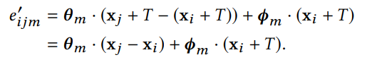
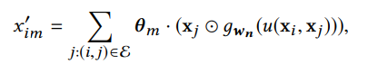
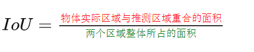

# EdgeConv

## 名词

Point cloud segmentation:点云分割

high-resolution:高分辨率的

fine-grained:详细的

## 要点

图1：随着层数的增加，红点距离最近的都能代表某个特定语义

点云

- 天生缺乏拓扑信息，因此设计一个模型恢复拓扑结构可以丰富点云的表现力。

基于语义需要

edgeconv优势：既能捕捉本地的几何结构又可以保持排列的不变性

图2：左图通过点对xi，xj计算边的特征eij，中间是一个全连接层

右图EdgeConv的过程，通过聚合连接到邻居边的特征作为输出

Edge feature
$$
e_{ij} = h_\Theta(x_i, x_j)\\
h_\Theta:\mathbb{R}^F\times\mathbb{R}^F\rightarrow\mathbb{R}^{F'}
$$
第二个公式的函数是一个非线性函数，有一系列可学习参数Θ

第i个顶点的EdgeConv的输出
$$
x_i'=\square_{j:(i,j)\in\Epsilon}h_\Theta(x_i, x_j)
$$
E是边的集合

### h和□的选择

e.g.1
$$
x_{im}'=\displaystyle\sum_{j:(i,j)\in\Epsilon}\theta_m\cdot x_j
$$
其中Θ=(θi),i=1,2,...,M编码M个不同filters的权值。θ维数和x相同，这两个向量做内积。

e.g.2
$$
h_\Theta(x_i, x_j)=h_\Theta(x_i)
$$

只编码全局信息，忽略局部的邻居结构，用在PointNet中(因此PointNet是EdgeConv的一种特殊情况)

e.g.3
$$
h_\Theta(x_i, x_j)=h_\Theta(x_j)\\
x_{im}'=\sum_{j\in V}(h_{\theta(x_j)}g(u(x_i,x_j)))
$$

g:高斯核函数

u:计算欧式距离

用在PointNet++中

e.g.4
$$
h_\Theta(x_i, x_j)=h_\Theta(x_j - x_i)
$$

- 只有局部信息

e.g.5(最终采用的h)
$$
h_\Theta(x_i, x_j)=\bar h_\Theta(x_i,x_j - x_i)
$$
我们可以定义我们的运算符号（这是h）
$$
e_{ijm}'=ReLU(\theta_m\cdot(x_j-x_i)+\phi_m\cdot x_i)\\
$$
最终
$$
x_{im}'=\max_{j:(i,j)\in\Epsilon}e_{ijm}'
$$
(max是□）Θ=(θi,Φi)，i=1,...,M

### 动态更新图结构

对于每个点，计算距离矩阵并选取距离最近的k个点作为新边

### 性质

- 排列不变性：xj不同的输入顺序不会影响xi'的大小
- 平移不变性：具有"部分"平移不变性

如果Φm=0，那么该式具有真正的平移不变性，但同时也丧失了绝对的属性

### 与已经存在的方法作比较

- PointNet:k = 1,E = 空集，忽略局部信息

- PointNet++:

  - FPS(最远点采样)：算法过程：
    - 随机选择点集中的一点加入点集
    - 在剩余点中选取与点集中的点距离最远的点，将其加入点集
    - 重复第二步，直至选够指定点数
  - 他们使用的方法为：每一层图的粗糙化（聚类精简）+FPS
  - 每一层过后图都会变得更小
  - 训练时固定图结构
  - 聚合操作为max

- Monti使用图结构计算一个局部的邻域顶点被表示的"伪坐标系系统"u；卷积被定义为M-component高斯混合

  

  g:高斯核函数

​	  ⊙:Hadamard积(对应元素相乘)

​	  {w1,...,wN}:编码高斯函数的可学习参数

​	  {θ1,...,θM}:可学习的filter参数

​	  u根据节点的度来建立

​	  f是Σ后面的一坨，□是sum

- Atzmon

### 评价

#### 分类任务

- 数据集：ModelNet40，分类任务，包括预测之前从未见过的形状的类别，每个模型都会从网格面中均匀采样1024个点，使用(x,y,z)坐标，通过随机缩放物体大小，扰动物体和点的方式来增加数据量
- 架构：figure 3
  - 四个EdgeConv层去抽取几何特征，使用三个共享的全连接层(64,64,128,256)(描述的好像和图上的不太相符)
  - Shortcut connections:抽取多个区域的特征，有一个共享的全连接层(1024)聚合多个区域的特征，对象是前面连接形成的512维的点云
  - max/sum pooling：得到点云的全局特征
  - 用两个全连接层(512,256)去变换全局特征，使用了保留可能性为0.5的丢弃
  - 80%训练，20%验证来寻找最好的k
- 训练：SGD,初始μ=0.1,使用余弦退火算法将其降低至0.001
  - 不使用batch normalization decay
  - batch size:32 momentum:0.9
- 结果

#### 模型复杂度

- 适中

#### 在ModelNet40上的更多实验

CENT:使用xi与xi-xj的结合作为边的特征而不是xi和xj

DYN:动态更新图结构

MPOINTS:更多的点

- 太多的k反而会破坏每一批的几何结构

#### 点云分割

- 数据集：ShapeNet。在这个任务中，点云集中的每一个点都被归类为一些预定义的部分分类标签中的其中一个
- 架构：figure 3
- 训练：使用了两个NVIDIA TITAN X GPU
- 结果：
  - 评价指标：Intersection over Union
  - 
- 云间距离：在第三个EdgeConv层之后进行评价
- 部分数据的分割(鲁棒性检验)：
  - 方法：模拟一个环境，在物体的六个方向(上下左右前后)之一进行不同比例的减少
  - 结果：mIoU(平均IoU)随着保留比率的增长而增加

#### 室内场景的分割

- 数据集：S3DIS，用于语义场景分割任务，每一个点属于13个语义分类的 其中一个
  - 将每个点表达为一个9维向量(XYZ,RGB,标准化后的空间坐标)
  - 在训练过程中，每个区块采样4096个点，所有点用做测试
  - 在6个区域上使用了同样的6折交叉验证，报告了平均评估结果
  - 为每个输入点生成了语义对象分类的概率分布，没有使用分类向量
  - 额外的点特征被用来手动创建特征喂给MLP分类器
