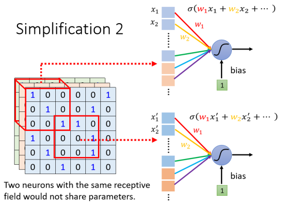
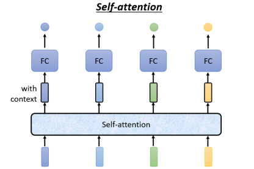
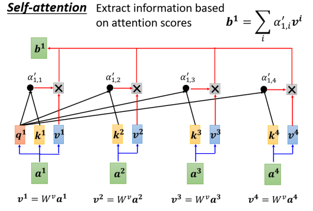
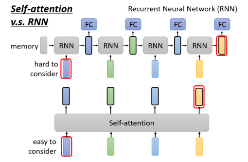

# 李宏毅深度学习

## Lecture 1:Regression

任务：回归、分类、体系化学习(产生的有结构性的东西)

MAE:误差的绝对值的平均

MSE:误差的平方和

:star:局部极小值是梯度下降法的假问题

分段线性曲线：(hard sigmoid)

可以用多个曲线来模拟任意一个函数

可以用Sigmoid曲线来逼近

batch:每次**更新**在不同的database batch上

### 迭代(Epoch)vs更新(update)

换一次batch就是一次更新，遍历完一次database是一次迭代

`Hard || Soft Sigmoid`,`ReLU`统称为激活函数。

神经网络：由多层、每层多个`sigmoid`/`ReLU`激活函数组成，在深度学习中叫隐藏层。多个隐藏层叫深度学习。

## Lecture 2:整体指导

### 解决模型偏差的问题

遇到问题时先尝试比较小与浅的网络，甚至可以用线性模型、SVM之类的简单模型来拟合，然后再来一个深的模型来调参。

### 解决过拟合问题

- 给模型制造限制
  - 给较少的参数：全连接层
  - 使用较少的特征
  - 早停、正则化、丢弃
- 但也不能限制太大（回到模型有偏差的原始问题）

### Mismatch

训练集与测试集分布不同，与过拟合不同

### 交叉验证

将训练集拆成训练集和验证集

- N-折交叉验证：将训练集分成N等份，选择其中一份作为验证集，其余为训练集

## Lecture 3:局部极小值与鞍点--梯度为0

判断其是极小值/鞍点的方法：二阶导
$$
L(\theta) \approx L(\theta ') + (\theta - \theta ')^Tg + \frac{1}{2}(\theta - \theta ')^TH(\theta - \theta ')
$$
最右的一项为二阶部分，H为海塞矩阵。

H正定：局部最小值->所有特征值均为正

H负定：局部最大值

既不是正定也不是负定：鞍点

找出负特征值所对应的特征向量即可走出鞍点（运算量最大的方法）

:star:在低维空间中的局部最小值，到了更高维的空间中说不定就会变成鞍点

:star:很多时候梯度为0只是卡在了鞍点而不是局部最小值

## Lecture 4:分批(batch)和动量方法

### Batch

shuffle（洗牌）：常见做法为每个迭代之间洗牌batch，使每次迭代的batch都不一样

当每批的样本个数和总样本个数一样时，相当于没有分批。缺点为花费时间较长。

batch size为1时，相当于每一个样本结束后都会更新一次参数。

Batch size为1还是1000，所需时间相差无几。（原因：GPU并行运算）

- 大的batch size一次迭代的时间会相对较少，但是验证集和训练集的准确率都会下滑。
- 小的batch size可以减少鞍点所带来的“卡脖子”的情况，且对测试集的准确率会有提升。原因：局部最小值也有好坏之分。

平坦的是好的，尖锐的是坏的，如果测试集分布与训练集有一定差异，平坦的最小值不易对准确率造成太大的影响。

- 大的batch size倾向于进入sharp，小的倾向于进入flat。

### Momentum

在一般的梯度下降的基础上，根据前一个位移的情况再往前助推一步。
$$
m^0 = 0\\
m^{i + 1} = \lambda m^i - \eta g^i\\
\theta^{i+1} = \theta^i + m^{i+1}
$$

## Lecture 5:有适应性的学习率

Fixed μ带来的问题：可能在前一阶段需要的特别低，后一阶段又需要高的学习率。

定制化的学习率：
$$
\theta_i^{t+1}\leftarrow \theta_i^t-\frac{\eta}{\sigma_i^t}g_i^t\\
$$
σ的计算方式：

- 平方根

$$
\sigma_i^t=\sqrt{\frac{1}{t+1}\displaystyle\sum_{j=0}^t(g_i^j)^2}
$$

这个方法在Adagrad中得到运用，实现了梯度较大时学习率较小，梯度较小时学习率较大的自适应。

- RMS Prop：相比Adagrad加了一个α参数，删除了分母

$$
\sigma_i^0=\sqrt{(g_i^0)^2}\\
\sigma_i^t=\sqrt{\alpha(\sigma_i^{t-1})^2+(1-\alpha)(g_i^t)^2}
$$

α则需要超参数进行调整。

- Adam:RMS Prop + Momentum

使用自适应性学习率有一个问题：在接近局部极小值的时候，因为平坦，小的梯度不断累积，使得可能会出现突然左右震荡的情况，不过这种情况在震荡后又会较小，如此反复。原因是震荡后的梯度又比较大，又会减缓每次走的距离。

### 解决方法：学习率的调度

常见策略：

- 学习率的“腐化”，让学习率随着每一次参数的更新越来越小。
- “热身”：让η先变大后变小

其速率也是需要超参数来调整。

变形之一：
$$
\theta_i^{t+1}\leftarrow \theta_i^t-\frac{\eta}{\sigma_i^t}m_i^t\\
$$

## Lecture 6:Batch的规范化

### 特征的规范化

标准化：
$$
\tilde{x}_i^r\leftarrow\frac{x_i^r-\bar x_i}{\sigma_i}
$$

### Batch规范化

在进行标准化的基础上与向量γ做内积后加上β

作用：调整一下z帽的分布

初始值：γ全1，β全0

### 测试

测试集没法用batch nomalization的这一套解决，因为根本没有batch。实际上，这需要在训练集中完成，在每次参数更新时，
$$
\bar\mu\leftarrow p\hat\mu+(1-p)\mu^t
$$
p是超参数，pytorch中默认为0.1。

## Lecture 7:分类

### 独热向量

### Softmax

将任意的y值规约到0-1之间
$$
y_i'=\frac{exp(y_i)}{\sum_jexp(y_i)}
$$
将大值与小值的差距变大

计算预测y‘和标签值的距离

- MSE

$$
e=\displaystyle\sum_i(\hat y_i-y_i')^2
$$

- 交叉熵（通常配合softmax使用）

$$
e=-\displaystyle\sum_i\hat y_i\ln y_i'
$$

一般在分类问题上使用交叉熵，因为MSE在损失比较大的时候梯度就会趋于平缓。

## Lecture 8:CNN（卷积神经网络）--用于图像识别

### 一种介绍卷积层的方式

一张图片是三维的张量，三个信道（channel）分别为RGB。

张量变成向量的方法：拉直

问题：如果全连接的话，假设有1000个神经元，就会产生3*10^7个参数，运算时间长且容易过拟合。

#### 观察1

选择一些有辨识度的特征进行训练

不同的神经元负责辨认不同的部位

#### 观察1-->简化1

感受野（Receptive Field）：每一个神经元都只关心自己感受野之内的东西

步骤（感受野大小3*3\*3为例）：

- 将其拉直为27维的向量并将其作为神经元的输入
- 将其加上权值和偏置之后送给下一层的神经元作为输入

注意：

- 感受野可以重合甚至可以一个感受野配备多个神经元。
- 感受野可以有不同大小，可以为任意形状

##### 经典的感受野安排方式

- 看所有的channel：因此不用讲深度，直接看宽和高，合起来叫做Kernel Size，常见的设定方式为3*3，一般会有64/128个神经元守备一个感受野的范围。

- Stride：从基点感受野移动的步长

这是一个超参数，一般为1/2.如果移动到超出范围就要做一个填充(padding)，一般为补0。

#### 观察2

同样的特征可能会出现在图片的不同区域。

问题：不同的守备范围都需要有一个侦测鸟嘴的神经元，参数太多了。

#### 观察2-->简化2

目的：让参数共享

- 参数完全相同

##### 经典的共享方式

让每一个感受野都只有一组参数：Filter

#### 总结：卷积层的好处

全连接层+感受野+参数共享=卷积层

用到卷积层的网络就叫做卷积神经网络，即CNN。

### 另一种介绍卷积层的方式

- 卷积层中有很多的过滤器(Filter)

每一个过滤器的作用是识别图片中的一个特征。

#### 侦测特征的方法：卷积（内积）

将每个感受野中的矩阵与过滤器做卷积

对每个过滤器都做一次卷积，得到特征映射图(Feature Map)

这是第一层经过卷积层后得到的特征，前一层有多少个filter后一层的高度就是多少，这里假设第一层有64个filter，第二层高度就是64.

- 网络叠加的层数越多，看的范围越大

### 两种看卷积层方式的总结

- 神经元视角：仅需观察图片的一小部分，每一个小部分都检测一个小范围，对于全局出现的相同filter以共享参数的方式呈现
- filter视角：每个filter都可以覆盖图片的每个角落，在进行卷积运算之后可以映射成feature map，其中一个数值重叠起来就是处理前的一个感受野。

### 观察3--池化

将原图中的一半像素点拿掉，图片缩小为原图的1/4，但人眼不会看出内容的差别，因此出现了池化压缩图像的概念。

- 池化不是一个层，没有根据数据学习任何东西。

Example:最大池化：分组，然后选择组中最大的一个

### 卷积层+池化

- 实际上：卷积层和池化交替使用。
- 因为池化对于最终的模型表现会有些影响，加上算力的提升，近年也在开始放弃池化的操作。

### CNN总结

Flatten：把矩阵的变量拉直为向量，然后丢进全连接层，最后加一个softmax得到图像识别的结果。

## Lecture 9:自注意力

### 向量集合作为输入

#### 文字处理

句子里面的每一个词汇都描述成一个向量，将词汇表示成向量

- 最简单的做法：独热编码

问题：它假设所有词汇之间都是没有关系的

- 词嵌入(Word Embedding)

#### 声音信号

将一段声音信号取一个范围--Window

将Window里面的资讯描述成向量--Frame

#### 图

可以将每一个节点看作一个向量

#### 分子信息

- 一个分子可以看成一个图
- 每一个原子表述为一个向量
- 一个原子可以用独热编码来表示

### 输入所对应的输出

- 每一个向量有一个对应的标签(Sequence Labeling)

- 一整个序列只输出一个标签

- 由机器决定输出标签的个数（sequence to sequence）

### Sequence Labeling

朴素的想法：用一个全连接层

缺陷：I saw a saw中，后面的saw和前面的saw无区别

解决方案1：将前后的词向量串起来（成为window）再放到全连接网络

缺陷：无法覆盖整个序列长度（序列有长有短，但window不能自由伸缩）

终极解决方案：Self-Attention

### Self-Attention

- Self-Attention会注意一整个序列的资讯

- Self-Attention可以叠加多层，可将全连接层与自注意力交替使用

#### 过程

以b1的产生为例。向量与a1的关联程度用α表示。

α的产生：

- 将两个向量与矩阵W q和W k相乘
- 所得结果可以做点积，也可以相加后求正切值

下面的求解过程默认使用点积法，产生的α成为注意力分数

q1相当于要搜索的关键字，k2相当于被搜索的关键词，点积之后就能得到注意力的分数。α1,3等同理。理论上也可以和自己算关联性。

随后放入一个Soft-Max

也可以用别的激活函数，比如ReLU等。

将初始的ai都乘上Wv得到新向量vi

将其与处理过的α‘1,i相乘，得到一个数，将其相加可得b1

如果a1和a2的关联性较大，那么α‘1,2就会较大，最后的b1也会更接近a2。

### 矩阵角度

将向量合并起来成为矩阵

ki与q1做的内积可以转换为KT和q1的乘积

以此类推：

### Self-Attention总结

$$
Q=W^qI\\
K=W^kI\\
V=W^vI\\
A'\leftarrow A=K^TQ\\
O=VA'
$$

I为输入矩阵，由ai拼接而成，O为输出矩阵，由bi拼接而成。

需要学习的参数：WqWkWv

### Multi-head Self-Attention

这里使用了两个头：采用两个不同的矩阵，将qi转化为qi,1和qi,2.剩下的也都需要两个矩阵来变换。

意义：问题中有多种不同相关性的时候可以增加head来表示。

后续计算时在相同的head中进行变换，方法与上文相同。

最后将得到的两个head进行变换，矩阵为WO,最后得到变换后的向量bi，作为输入进入下一层。

### 位置编码(positional encoding)

- 目前的self-attention没有任何的位置信息
- 位置信息在句子分析中还是有一定重要性的，比如动词不容易处在句首

方法：为每个位置设定一个位置向量，用ei表示，i代表位置，不同位置有不同的向量。

将其加在ai上即可。

#### 手动创造 or 从数据集中学习

以上的位置向量是手动创造的，只适用于固定的序列长度。位置向量也可以通过一个固定的规则或者学习资料产生。

### 应用

- BERT：自然语言处理领域
- 语音处理：Truncated(截断的) Self-Attention,只取一小段范围进行处理，范围多大由人为设定。
- 图片
- CNN可以看作是一种简化版的Self-Attention
  - 因为CNN只考虑了感受野内的资讯，而Self-Attention考虑了整张图片的资讯。
  - CNN中感受野的范围是人划定的，Self-Attention中感受野的范围是自己学出来的
  - Self-Attention相比于CNN弹性较大，但也需要更多的训练资料来达到比CNN更好的训练效果。

#### Self-Attention vs. RNN

RNN(循环神经网络)很大一部分可以被self-attention取代。

RNN只考虑了已经输入的向量的处理，没有考虑完整的序列

- 但RNN也可以双向进行

还有一个区别是如果蓝色与黄色关系较大，使用RNN带来的信息衰减较强，因为间隔层数较多，但是self-attention就没有这个问题。

并且RNN没法并行处理，但self-attention可以。

- 图（另起专题学习）

self-attention缺点：运算量大

## Lecture 10:Transformer

### Seq2seq

- 不知道输出多长时使用
- 可用于语音识别、机器翻译、语音翻译等
- 聊天机器人
- 智能问答

### 文法剖析

输入及输出：

### 多标签分类任务(multi-label classification)

#### multi-label vs.multi-class

前者的输出只能为一个分类，后者的输出可以为一个或多个分类。

### 物品检测

### 编码-解码

seq2seq model分为编码和解码两个部分，其为应用层的概念

transformer和encoder-decoder都是网络架构层面的概念

传统的Encoder-Decoder会使用rnn、lstm、gru来进行构建，而transformer则是放弃了使用常见的RNN结构，使用了一种新的方式。

### 编码器(Encoder)

作用：给一排向量，输出另外一排向量。

- self-attention:heavy_check_mark:
- RNN
- CNN

一个编码器中包含若干块(block)，每一个block基本包括一个self-attention和一个全连接层。

在transformer中，在输出**b**之外，还需要加上输入**a**得到新的输出。

这样的网络架构叫做残差链接(residual connection)。得到结果之后做一次标准化，这里是层标准化(layer normalization)。

相比起batch标准化，层标准化不需要乘上矩阵并加上偏置。

在FC(全连接)处，也会有residual架构，同样将输出和输入加起来形成新的输出。

### 编码器总结

- 在self-attention的输入处加上位置向量
- multi-head attention
- residual+layer normalization
- feed forward：全连接层FC
- 再做一次residual+normalization

以上为一个block的内容，这一个block会重复若干次。

### 解码器-自回归的(Autoregressive/AT)

#### 产生一段文字的过程

给一个特殊的符号Begin of Sentence(BOS)

- 特殊令牌，代表开始
- 也用独热编码表示

decoder生成的向量长度和词汇表的大小相同

第一次的输入只有开始字符

在生成最后的向量之前通常会跑一个softmax使其总和为1

分数最高的文字即为输出，这时输出第一个文字块

然后将第一个字体块一并作为新的输入

不断循环，得到最终结果。

#### Masked Multi-Head Attention

bi只能够通过上角标不超过i的a的资讯生成，即qi只可以和上角标不超过i的k计算Attention score

原因：输出的东西是一个个产生的，所以只能考虑左边的输入，没办法考虑右边的东西。

目前存在的问题：decoder必须自己决定输出的长度

解决方法：再准备一个特殊符号作为结束符号

### 解码器-非自回归的(Non-autoregressive/NAT)

## Lecture 23:对抗攻击

### 	--避免别有用心的人恶意用词逃过神经网络的分类/排除异常因子

#### 如何攻击？

##### 无目标攻击

交叉熵(Cross Entropy)：

-H(p, q)越小越好

##### 有目标攻击

$$
L(x) = -e(y, \hat{y}) + e(y, y^{target})\\
d(x^0, x) \le \epsilon
$$

第二个式子是为了减少与原图的差距，ε为一个门槛，低于该杂讯时默认人的肉眼无法识别。

###### 第二个式子怎么算？--将图像化为向量

- 2-范式：平方和

- 无穷范式：最大值

无穷范式更接近人类的感知能力，只选取变化最大的作为距离。

2022.7.10：开错ppt了...

