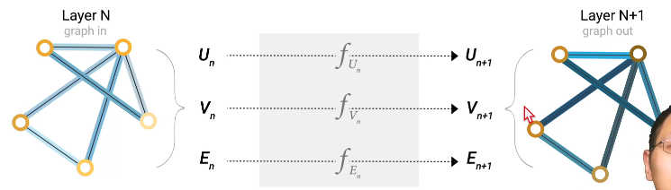
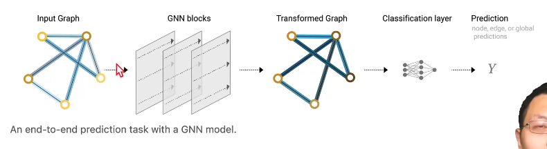

- GNN:对图上所有属性(顶点、边、全局)进行一个可以优化的变换
- 使用信息传递的框架来描述

MLP:多层感知机

simplest GNN

只对属性值发生变换，不对结构产生变化

V,E,U三缺一可以用别的两个属性，将与位置属性相关的别的两个属性值全加起来作为缺失属性值

当前结构的缺陷：U,V,E喂到不同的MLP，彼此之间没有关系

GCN:考虑节点与邻居节点之间的关系，将节点自己和邻居的属性值相加再通过MLP生成下一层该节点的属性值

全局信息的加入：master node / context vector,和所有的V和E相连